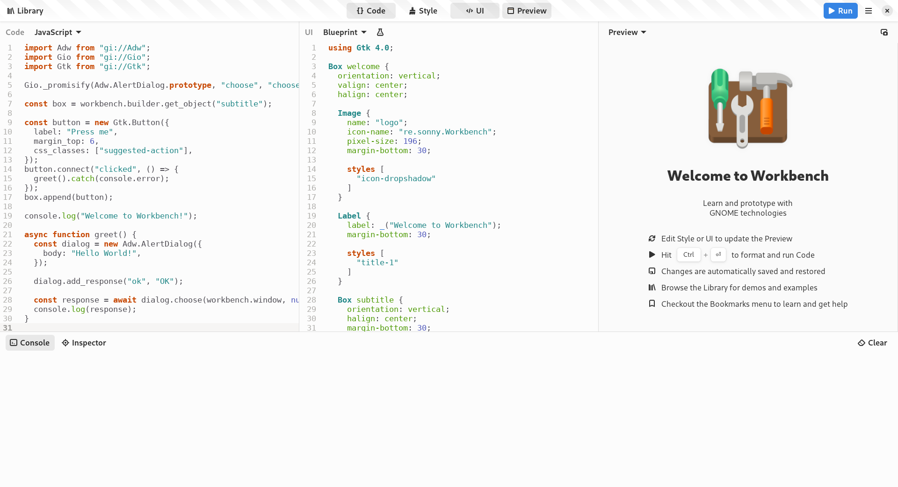
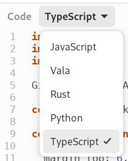

<!--
_class: gaia lead
-->

# The Newest JavaScript Technologies in GNOME


<div style="display: inline-grid; grid-template-columns: 1fr 1fr;">
<div>

**Evan Welsh**
<i class="fa-solid fa-message"></i> @ewlsh:gnome.org
<i class="fab fa-gitlab"></i> ewlsh

</div>
<div>

**Philip Chimento**
<i class="fa-solid fa-message"></i> @ptomato:gnome.org
<i class="fab fa-gitlab"></i> ptomato

</div>
</div>

GUADEC, July 19, 2024

---

# Introduction: What this talk is about

- Using **TypeScript** to write GNOME apps
- Community-led **documentation** updates
- **What's new and what's next** in GJS?
- 🎩 **Thanks** to everyone who contributed!

<!--
  Today we'll be talking about what's new and what's next with JavaScript in GNOME. Evan will be 
-->

---

# Introduction

- Presentation is full of links if you want to click through later
- If you want to follow along: [**ptomato.name/talks/guadec2024**](https://ptomato.name/talks/guadec2024)
- ㊻, ㊼, 🎩

<!--
  This slide deck is also meant to be a resource that you can consult later. The slides are already available on Philip's web space so if you want to click on the links NOW, you can already go there and follow along with the presentation.

    By the way, I'll use these little circled 46 and 47 icons to show things that you can expect to see in GNOME 46 and 47. And when you see a hat emoji, that's me tipping my hat to the person who contributed it.
-->

---

<!-- _class: lead invert -->

# Community

---

# State of TypeScript for GNOME

The first beta of [unified TypeScript definitions](https://github.com/gjsify/ts-for-gir) has been published 😮

Since then Pascal has been working on filling in feature gaps and Evan has been bug hunting.

_Thanks to STF funding_ ⭐

---

# How to use TypeScript today

A massive shoutout to Chris Davis for working continuously on a [TypeScript template for GJS](https://gitlab.gnome.org/World/javascript/gnome-typescript-template)

Most apps should start there!

---

# How to use TypeScript today (experimental)

If you're developing Shell extensions or are adventurous, the beta bindings are [currently published as NPM packages](https://github.com/gjsify/ts-for-gir?tab=readme-ov-file#npm-packages)

⚠️ Distro packaging with NPM packages is not simple, so proceed with caution for apps. ⚠️

We're working to support an ideal format for the TypeScript template and distro packaging, reach out if you want to help!

---

# More Community initiatives

_We have a GNOME-home for JavaScript projects now!_

## gjs.guide

gjs.guide has a new (more official) home at https://gitlab.gnome.org/World/javascript/gjs-guide

## the TypeScript template

The TypeScript template is at https://gitlab.gnome.org/World/javascript/gnome-typescript-template

---

# gjs.guide

- Updated and upgraded with better search and easier navigation
- Docs written this year...
  - Extensions, the Shell, and GNOME 46 (🎩 Andy, Javad)
  - D-Bus (🎩 Andy)
  - St widget examples (🎩 Nitin Dhembare)

🎩 _to Sebastian Wiesner, Daniel Steele, Adrien Delessert,  Evangelos Paterakis, "Bytez", Jeffery To, Marko Kocic, Pedro Sader Azevedo and many more for adding examples, fixing typos, and making the community better_ 💙 

---

# Workbench



<!--
    There is a library of demos and examples, similar to GTK demo but more aligned with the HIG and less "benchmarks" / test cases
    with examples ready to use, copy paste and play with
    I will talk more about it tomorrow in the  GNOME JavaScript Tooling talk
    also, there will be a workbench workshop on Saturday
-->

---

# Workbench improvements

<div class="twocolumn">
<div class="col">

- TypeScript support!
- Write JS/TS code in Workbench with autocomplete support using the language server!
- 🎩 Angelo Verlain

</div>
<div class="col">



</div>
</div>

---

<!-- _class: invert lead -->

# What's new in GJS

## for GNOME ㊻ and ㊼?

<!--
    What's new for GNOME 46 and the upcoming GNOME 47?


  This part of the talk is primarily aimed at people who write code for the GNOME platform in the JavaScript programming language, whether that is GNOME Shell, apps, shell extensions, or even command line scripts. GNOME has its own JavaScript engine for all these purposes, GJS, which is an extended version of the JavaScript engine from the Firefox browser.

  In past years I talked a lot in the "what's new and what's next" sections about the various ways to modernize your code, but nowadays we are running a pretty modern JavaScript in GNOME already, with no modernization "backlog". The new language features are still pretty exciting, but there's nothing earthshaking like ES6 classes. Additionally, we have a lot more visibility of these improvements these days, with better documentation, a more active community of GJS developers, and initiatives like This Week in GNOME, so a yearly GUADEC talk is no longer the only channel where people find out about these things. Nonetheless, I've gotten feedback that people still find these talks useful, so that's a good reason to keep doing them in addition to all those other things I mentioned.
-->

---

## Console output ㊻ ㊼

- Improvements in logging repository namespaces, e.g. `imports.gi.GLib` ㊻ 🎩 Sriyansh Shivam
- Recent improvements in logging objects with circular references, ParamSpecs, Uint8Arrays ㊼ 🎩 Gary Li
- Improvements to pretty printing in `console.log`/REPL/debugger is a great place to get started if you want to contribute to GJS

<!--
We have a human-friendly formatter for JS values. Also traditionally called a "pretty printer". It was added by Nasah Kuma in an internship a couple of years ago. It's used in several places in GJS: in console.log, in the interactive interpreter, and in the debugger. It's a great place to get started if you're interested in contributing to GJS. We have a bunch of issues open to improve the pretty printer and it's quite easy to write tests, as well.
Sriyansh and Gary have both made some of these improvements in the past year and I hope to see more people following their lead!
-->

---

## Performance improvements ㊻ ㊼

- Performance of setting/getting GObject properties improved
- More improvements to come
- 🎩 Marco Trevisan, as usual!

---

# An update on async support

We've been working on getting rid of `Gio._promisify`...

- GObject Introspection now has async annotations 🥳 ㊻
- GLib + GObject Introspection will soon support native async operations  
- GJS has a draft MR to support the work ... ㊼?

_Thanks to STF funding_ ⭐

<!--
Transition to Philip
-->

---

# JS engine upgrades ㊼

GJS's underlying JavaScript engine is the one from Firefox, but embedded.

- Tracks Firefox's long-term support version (currently Firefox ESR 115)
- Brings in newer editions of the JS language, and security updates
- GNOME ㊼ will upgrade to Firefox ESR 128

<!--
    I almost always have a section on what JavaScript language features are new, when we upgrade the version of the underlying JavaScript engine to one from a newer Firefox. This year we're planning to upgrade to Firefox 128 in GNOME 47.
-->

---

## Intl.Segmenter ㊼

```js
const segmenter = new Intl.Segmenter('en', { granularity: 'word' });
const segments = segmenter.segment('The mile-high city');
for (const { segment, isWordLike } of segments) {
  if (isWordLike) {
    console.log(segment);
  }
}
// The
// mile
// high
// city
```

<!--
- Split strings into graphemes, words, or sentences according to locale rules
-->

---

## groupBy ㊼

```js
array = ['the', 'array', 'has', 'words'];
Object.groupBy(array, word => word.length);
// => {
//      '3': ['the', 'has'],
//      '5': ['array', 'words'],
//    }
```

- compare Lodash's `_.groupBy()`
- also `Map.groupBy()` to create a Map instead of plain object

---

## Promise.withResolvers ㊼

- Useful for integrating promises with signal-based APIs
```js
function promisifyWebKitDownload(dl) {
  let {promise, resolve, reject} = Promise.withResolvers();
  const finishID = dl.connect('finished', resolve);
  const failID = dl.connect('failed', (_, error) => reject(error));
  return promise.finally(() => {
    dl.disconnect(finishID);
    dl.disconnect(failID);
  });
}
```

---

## ArrayBuffer transfer ㊼

- Zero-copy ownership takeover of data buffers
```js
async function validateAndWrite(arrayBuffer, stream, prio, cancellable) {
  const owned = arrayBuffer.transfer();
  // transfer() "detaches" the old object and creates a new one without copying. If we
  // didn't transfer, other code might modify arrayBuffer while we await validate()
  await validate(owned, cancellable);
  const bytes = new Uint8Array(owned);
  await stream.write_bytes_async(bytes, prio, cancellable);
}

const bytes = new TextEncoder().encode("a string");
validateAndWrite(bytes.buffer, stream, ...asyncArgs);
setTimeout(() => (bytes[0] = 0x00), 5);  // 😱😱😱
```

---

## Update your code

- GLibUnix / GioUnix / GLibWin32 / GioWin32 ㊻
- `new Gio.FileIcon(myFile)` vs `Gio.FileIcon.new(myFile)` ㊼
- `get_data()`/`set_data()` and `ref()`/`unref()` are blocked ㊼

<!--
When gobject introspection moved into GLib (which Philip Withnall will give a talk on later) we got separate namespaces for platform-specific APIs. The old ones will still work for the time being, but you'll get a deprecation message.

The code snippets on the second line here is a pitfall of GObject-introspection that caused confusion over and over again. All GObjects have constructors that take a property bag, while some of them also have static methods named "new". Getting them confused often led to crashes. We've now changed the constructor so that it only accepts a plain object, not a GObject, and you'll get an exception. I hope no-one was relying on the old behaviour, but if you were and migrating your code is not straightforward, let us know and we'll revert that change in favour of a longer deprecation period.

Many crashes were caused by trying to use C-only APIs such as reference counting and pointer stashing. We just block these now. (I'm not sure why we never did that before!) If you used them, sometimes they would crash, or sometimes they would appear to work. If your code used them and appeared to work, well, now it definitely won't work. Just delete the usage.
-->

---

<!-- _class: invert lead -->

# What's coming down the line in JS

<!--
This part overlaps with what I do in my day job at Igalia, as a member of the TC39 committee that standardizes the JavaScript language. I'm excited to present some of these!
-->

---

## Already implemented in nightly Firefox

- new `Set` methods (union, intersection, etc)
- Resizable `ArrayBuffer`
- We'll get these in next year's SpiderMonkey update

---

## WinterCG

- [Common Minimum API Proposal](https://common-min-api.proposal.wintercg.org/)
- Any interest in joining this group on GNOME's behalf?

---

## Other exciting proposals coming 2025 or 2026

- `Temporal` (I gave a [talk](https://ptomato.name/talks/globalscope2021/) on it if you want to know more)
- Decorators
- Iterator methods
- `using` statements

<!--
There are many more proposals in the pipeline, but these are the ones I'm particularly looking forward to or that I think are relevant to GNOME.

Excited to see Temporal finally coming to SpiderMonkey as I've been personally working to bring this proposal to JavaScript for the past couple of years! Especially together with Intl which I'll talk about in a bit, I'm excited to use it in GNOME Shell's JS code at some point.

Decorators we've been eagerly awaiting for the better part of a decade! - I first wrote a blog post on designing a decorator API for GObject classes in July 2017.

If you've written code in Rust or Python, you probably have gotten used to iterators. Iterators exist already in JS but without all the neato methods 

Using statements are kind of like context managers and with-blocks in Python. They'll be quite useful for explicitly disposing resources, like disconnecting signals and such, which is currently a bit of a hassle in GJS. Relying on it implicitly often runs into problems with callbacks being run during garbage collection. "Using" should help 
-->

---

## Intl.MessageFormat

- Stage 1 proposal, coming farther in the future
- Gettext is central to GNOME's workflow, but ...
- `xgettext` has always been a bit hacky to integrate with JS and is just flat-out broken for backtick strings
- We could drop Gettext integration in JS and move to Intl.MessageFormat for the developer API, while still consuming the Gettext files from GNOME's translation workflow
- Is anyone interested in a proof of concept?

---

<!-- _class: lead invert --->

# And on that note...

---

<!-- _class: lead invert --->


---

# GNOME and Intl

- `Intl` is a global object
- Does internationalization stuff for you
- Some things awkward to do with Gettext. `Intl` makes them easy
- Some things Gettext does well. `Intl` is gaining those capabilities...

<!--
  While we're on the subject of Intl, I want to make a pitch for why you should use it in your app or extension, as well as GNOME Shell.
  Intl is a global object that does internationalization stuff.

  Intl is great for formatting all sorts of things in a way that's aware of the user's locale.

This is something we have always cared about in GNOME: we are an international desktop environment and it's a huge part of our appeal that we are accessible in as many languages and cultures as we are. Shout-out to our volunteer translators!

Intl can't _yet_ replace Gettext, but with the MessageFormat proposal that I mentioned on the previous slide we might be getting there!
-->

---

## `Intl`

- `Intl.Collator` - locale-sensitive sort
- `Intl.DateTimeFormat` - print dates and times (`"Fri Jul 19"`)
- `Intl.DisplayNames` - translate names of regions, languages, ...
- `Intl.ListFormat` - print lists (`"A, B, and C"`)
- `Intl.Locale` - information about user's locale conventions
- `Intl.NumberFormat` - print numbers (`"€ 0,00"`)
- `Intl.PluralRules` - select appropriate plural form for language
- `Intl.RelativeTimeFormat` - print relative times (`"3 days ago"`)
- `Intl.Segmenter` ㊼ - split strings into graphemes/words/sentences

<!--
  You can do sorting, date and time formatting, number formatting.

  So, why you should use Intl.
  Imagine you're a translator and you see...
-->

---

# Why you should use `Intl`

```js
/* Translators: this is the month name and day number
 followed by a time string in 24h format.
 i.e. "May 25, 14:30" */
format = N_("%B %-d, %H\u2236%M");
```

- How does the translator know what to put there for their locale?

<!--
  ..this.
  This is actually from from gnome-shell.
  Not only does the translator have to figure out what the correct short date and time format is for their locale, and how to express it in this cryptic strftime format.
  They also have to punctuate it correctly, because in their translation UI this "U+2236 RATIO MARK" might look at first glance like a regular colon.
-->

---

<!-- _class: lead gaia -->

# “Well why don't they just read the manual for strftime?”

<!--
  Sorry I'm not going to make some overworked translation volunteers stop what they're doing and decipher the strftime codebook!

  And even if they did... now imagine you're the developer and you're integrating the new translations...
-->

---

# Why you should use `Intl`

```py
#. Translators: this is the month name and day number
#. followed by a time string in 24h format.
#. i.e. "May 25, 14:30"
#: js/misc/util.js:255
#, no-c-format
msgid "%B %-d, %H∶%M"
msgstr "%j, %R %p"  😱😱😱
```

<!--
  ...and you see this.
  Quick, is `"%j, %R %p"` a valid strftime string?
  The other question is how do you know that what the translator puts in there is correct?
  If you see this in a translation commit, you can read the strftime manual yourself to check it, but you can only guess or ask the translator if that was what they really meant!
-->

---

# Why you should use `Intl`

<div class="twocolumn">
<div class="col">

- More readable, even if longer
- Less burden on GNOME translators

</div>
<div class="col">

```js
format = new Intl.DateTimeFormat(myLocale, {
  dateStyle: 'medium',
  timeStyle: 'short',
  hourCycle: 'h24',
});
format.format(Date.now());
// ⇒ "Jul 17, 2024, 15:36" in my locale
```
</div>
</div>

<!--
  If you use Intl, then the code will look like this.
  It's certainly longer but, at least to me, it looks more readable.
  And most importantly, it doesn't need to be translated.
-->

---

# Why you should use `Intl`

- Who _does_ translate those, anyway?
  - [ICU project](http://site.icu-project.org/home)
  - Unicode [Common Locale Data Repository (CLDR)](http://cldr.unicode.org/)
  - They have the power of major browser vendors behind them

<!--
  Well you might ask, certainly someone has to translate that. Who is it? The answer is that these translations are provided by ICU and Unicode, which are projects with major corporate support behind them.
  So don't burden our volunteers to repeat stuff that's already paid for by large companies and freely available!
-->

---

# Why you should use `Intl`

- What if I don't like the ICU/CLDR's translations in my UI?
  - You can still customize them using `formatToParts()`

<!--
  You might say that this gives up our control of how we want dates and times to be displayed.
  And in some cases that is right.
-->

---

# Why you should use `Intl`

- What if I don't like the ICU/CLDR's translations in my UI?
  - You can still customize them using `formatToParts()`

## <span style="display: block; text-align: center"><span class="time">12:00</span> <span class="time">12∶00</span></span>

<!--
  An example of when you might want to do this is that ICU's translations use a colon character instead of the typographically correct ratio mark.
  In GNOME we do care about the little details like this.
  Intl formatters have a formatToParts method that gives you tagged segments of the string and allows you to customize them before pasting them together and presenting the string to your user.
-->

---

<!-- _class: gaia -->

# Thanks

GJS contributors from 46 and 47

# License

Presentation licensed under Creative Commons BY-NC-ND 4.0

<!--
    We'd especially like to thank Nasah Kuma for joining in with ideas for this talk, but unfortunately she couldn't be here to present.

    A big thank you as well to everyone who helped in any way with GJS in GNOME 44 and 45!

    Here's the license for this slide deck; you may reuse bits as-is, with attribution, and not for commercial use.

    Now it's time for...
-->

---

<!--
_class: invert gaia lead
_footer: Image: <a href="https://pixabay.com/users/IRCat-10981235">IRCat</a> from <a href="https://pixabay.com/">Pixabay</a>
-->


# Questions?

# &zwj;

<!--
  ...questions.
-->
