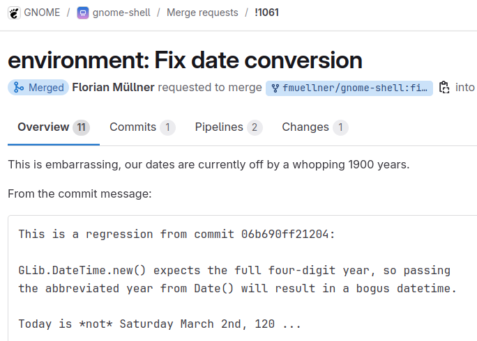

<!--
_class: gaia lead
-->

# JavaScript and TypeScript in 2025's GNOME

**Philip Chimento**
<i class="fa-solid fa-message"></i> @ptomato:gnome.org • <i class="fab fa-gitlab"></i> ptomato
<i class="fab fa-bluesky"></i> @ptomato.name • <i class="fab fa-mastodon"></i> mstdn.ca/@ptomato

GUADEC, July 26, 2025

---

# Introduction: What this talk is about

- Using **TypeScript** to write GNOME apps
- What's **new** and what's **next** in GJS?
- Some cool **project ideas** for you

<!--
  Today we'll be talking about what's new and what's next with JavaScript in GNOME.
-->

---

# Introduction

- Presentation is full of links if you want to click through later
- If you want to follow along: [**ptomato.name/talks/guadec2025**](https://ptomato.name/talks/guadec2025)

<!--
  This slide deck is also meant to be a resource that you can consult later. The slides are already available on my web space so if you want to click on the links NOW, you can already go there and follow along with the presentation.
-->

---

<!-- _class: lead invert -->

# GNOME Apps in TypeScript

---

# How to use TypeScript in GNOME today

- [TypeScript template for GJS](https://gitlab.gnome.org/World/javascript/gnome-typescript-template)
- Most apps should start there!
- [TypeScript definition generator](https://github.com/gjsify/ts-for-gir)

---

# Nonograms app!

- "Nonogram", "Picross", "Griddler", etc.
- Last year I nerdsniped JRB into adding support for them in libipuz
- So then I had to follow up with an app

---

# Nonograms app!

gif

<!--
My development experience was pretty good. TypeScript is a good fit for development with the GNOME platform.

Use the typescript template and most of it "just works".

I'll highlight a few things that were confusing.
-->

---

# Target "es2023"

- Unfortunately you need to downlevel `#private` fields
- TypeScript's semantics are slightly different than real JS semantics!
- (and TypeScript's semantics happen to be compatible with GJS)
- [Issue #451](https://gitlab.gnome.org/GNOME/gjs/-/issues/451)

<!--
TypeScript's downleveled code sets the class fields BEFORE the constructor, real JS code sets them AFTER
-->

---

# Internal compiled library

- Libipuz not in the flatpak runtime
- No TS definitions generated
- Generate as part of build process? Hand-write? :thinking:

```ts
import Ipuz from "gi://Ipuz";
import type { Nonogram } from "gi://Ipuz";
```

---

# But ... evil empire

- Try [ts-blank-space](https://bloomberg.github.io/ts-blank-space/)

---

<!-- _class: invert lead -->

# What's new in GJS

## for GNOME 48 and 49?

<!--
    What's new for GNOME 48 and the upcoming GNOME 49?

  This part of the talk is primarily aimed at people who write code for the GNOME platform in the JavaScript programming language, whether that is GNOME Shell, apps, shell extensions, or even command line scripts. GNOME has its own JavaScript engine for all these purposes, GJS, which is an extended version of the JavaScript engine from the Firefox browser.

  In past years I talked a lot in the "what's new and what's next" sections about the various ways to modernize your code, but nowadays we are running a pretty modern JavaScript in GNOME already, with no modernization "backlog". The new language features are still pretty exciting, but there's nothing earthshaking like ES6 classes. Additionally, we have a lot more visibility of these improvements these days, with better documentation, a more active community of GJS developers, and initiatives like This Week in GNOME, so a yearly GUADEC talk is no longer the only channel where people find out about these things. Nonetheless, I've gotten feedback that people still find these talks useful, so that's a good reason to keep doing them in addition to all those other things I mentioned.
-->

---

# Source maps (48)

- They Just Work™
- 🎩 Gary Li
- For example in TypeScript if you put `"sourceMap": true` in the config file

---

# Interactive interpreter stuff (48)

<div class="twocolumn">
<div class="col">

- History! (🎩 Gary)
- Do async stuff! (🎩 Evan & myself)
  - You can't yet `import` or `await` directly in the REPL but this is a prerequisite

</div>
<div class="col">

gif of both

</div>
</div>

---

# Other cool stuff in 48

- Examine private fields in debugger! (🎩 Gary)
- Performance improvements reading & writing GObject properties (🎩 Marco)

---

# JS engine upgrades (49)

GJS's underlying JavaScript engine is the one from Firefox, but embedded.

- Tracks Firefox's long-term support version
- Brings in newer editions of the JS language, and security updates
- GNOME 49 will upgrade to Firefox ESR 140
- What language features will we see in GNOME 49?...

<!--
    I almost always have a section on what JavaScript language features are new, when we upgrade the version of the underlying JavaScript engine to one from a newer Firefox. This year we're planning to upgrade to Firefox 140 in GNOME 49.
-->

---

# Temporal

- `Temporal` (I gave a [talk](https://ptomato.name/talks/jsnation2025/) on it last month if you want to know more)
- Dates, times, date-times, with and without time zones, arithmetic, calendars

```js
GLib.DateTime.new_from_iso8601(
  Temporal.Now.plainDateTimeISO().toString(),
  GLib.TimeZone.new_local()
)
```

<!--
Excited to see Temporal finally coming to SpiderMonkey as I've been personally working to bring this proposal to JavaScript for the past couple of years! I'm excited to use it in GNOME Shell's JS code at some point.
-->

---


<!--
(screenshot "This is embarrassing, our dates are currently off by a whopping 1900 years")
-->

---

# `using`

```js
{
  using stream = await file.read_async(...);
  const myFoobar = MyFoobar.new_from_stream(stream);
}
```
<!--
stream is closed, even if MyFoobar throws!
without waiting for stream to be garbage collected - it's closed when the variable goes out of scope, just like in C++
-->

---

# `using`

- Add the capability to your own objects with `[Symbol.dispose]()` and `[Symbol.asyncDispose]()`
- Anything you want to be dropped when you're done with the variable
- Disconnecting signals?
- This could revolutionize the way we write our JS code in GNOME
- Reminder: Don't use GObject dispose!

<!--
Using statements are kind of like context managers and with-blocks in Python. They'll be quite useful for explicitly disposing resources, like disconnecting signals and such, which is currently a bit of a hassle in GJS. Relying on it implicitly often runs into problems with callbacks being run during garbage collection. "Using" should help 
-->

---

# Iterator methods

`drop`, `every`, `filter`, `find`, `flatMap`, `forEach`, `map`, `reduce`, `some`, `take`

- It's nice to think of array operations in terms of map, filter, etc. instead of for-loops
- But the path of least resistance is often to iterate multiple times through an array
- Iterators let you have the best of both worlds!

<!--
I never used iterators for years despite them being RIGHT THERE in Python
then I did Advent of Code in Rust and was forced to use them, and now I understand why they're great!
-->

---

# Promise.try

```js
await Promise.try(() => file.read_async(...))
```

- Lets you collapse both synchronous and asynchronous results into one promise

---

# JSON imports

```js
import data from 'resource:///name/ptomato/Nonograms/puzzles.json' with { type: 'json' };
```

- Import json files directly from your GResource
- Instead of opening a stream and reading them

---

# New Set methods

`union`, `intersection`, `difference`, `symmetricDifference`, `isSubsetOf`, `isSupersetOf`, `isDisjointFrom`

---

# Conversion of Uint8Array to/from base64 or hex

`Uint8Array.fromBase64`, `Uint8Array.fromHex`
Uint8Array methods: `setFromBase64`, `setFromHex`, `toBase64`, `toHex`

<!--
We do already have base64 in GLib
-->

---

# Regex features

- `RegExp.escape()`
- pattern modifiers `+ims`
- duplicate named capturing groups

---

# Error features

- `Error.captureStackTrace`
- `Error.isError`

---

# Other various features

- Resizable ArrayBuffer
- Float16Array
- JSON.parse with source
- Intl.DurationFormat
- Math.sumPrecise
- Atomics.pause

---

<!-- _class: invert lead -->

# What's coming down the line in JS

<!--
This part overlaps with what I do in my day job at Igalia, as a member of the TC39 committee that standardizes the JavaScript language. I'm excited to present some of these!
-->

---

## TC55

- [Common Minimum API Proposal](https://common-min-api.proposal.wintercg.org/) (update link)
- Any interest in joining this group on GNOME's behalf?

---

## Other exciting proposals coming 2026 or 2027

- Decorators
- MessageFormat

<!--
There are many more proposals in the pipeline, but these are the ones I'm particularly looking forward to or that I think are relevant to GNOME.

Decorators we've been eagerly awaiting for the better part of a decade! - I first wrote a blog post on designing a decorator API for GObject classes in July 2017.
-->

---

<!-- _class: gaia lead -->

# Cool project ideas

---

# Write tests for import maps

- [Merge Request #843](https://gitlab.gnome.org/GNOME/gjs/-/merge_requests/843) - import map support for GJS
- Needs to be tested thoroughly!
- Write some automated tests and add to GJS's test suite

---

# Add `[Symbol.dispose]` to GNOME platform objects

- I wrote `using stream = await file.read_async(...)` earlier
- That actually requires adding `[Symbol.dispose]` and maybe `[Symbol.asyncDispose]` methods to `Gio.File.prototype`
- Need to look at the GNOME platform APIs and figure out where these methods could be added

---

# `await` and `import` in interactive console

- Browser devtools and Node can do this
- They actually parse the input and rewrite it
- We can do it with `Reflect.parse()`
- [Issue #620](https://gitlab.gnome.org/GNOME/gjs/-/issues/620)

---

# Use Temporal in GNOME code

- GNOME Shell has a clock and calendar component
- Maybe the Shell developers would be interested in using Temporal for these?

```
#. Translators: this is a time format string followed by a date.
#. If applicable, replace %X with a strftime format valid for your
#. locale, without seconds.
#: ../js/ui/telepathyClient.js:982
#, no-c-format
msgid "Sent at <b>%X</b> on <b>%A</b>"
msgstr "Unviáu el <b>%A</b> a les <b>%H:%M</b>"
```

---

# Figure out how to call GNOME functions in JIT

- Super vague idea
- Maybe we could teach the JIT to generate code for calling gobject-introspected functions?
- Push C values onto the stack and jump to the C routine
- Maybe possible, maybe not!

---

<!-- _class: gaia -->

# Thanks

GJS contributors from 48 and 49

# License

Presentation licensed under Creative Commons BY-NC-ND 4.0

<!--
    A big thank you as well to everyone who helped in any way with GJS in GNOME 48 and 49!

    Here's the license for this slide deck; you may reuse bits as-is, with attribution, and not for commercial use.

    Now it's time for...
-->

---

<!--
_class: invert gaia lead
_footer: Image: By [slava](https://secure.flickr.com/photos/slava/496607907/), CC BY 2.0
-->


# Questions?

# &zwj;

<!--
  ...questions.
-->
