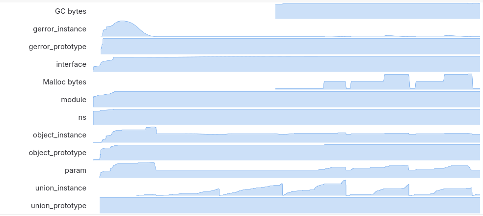

<!--
_class: gaia lead
-->

# JavaScript in GNOME 2026
## Types, Types, and More Types

**Philip Chimento**
<i class="fa-solid fa-message"></i> @ptomato:gnome.org • <i class="fab fa-gitlab"></i> ptomato
<i class="fab fa-bluesky"></i> @ptomato.name • <i class="fab fa-mastodon"></i> mstdn.ca/@ptomato

GUADEC, July 16, 2026

<!--
Hiiiiiii everybody

My name is Philip Chimento

I'm the maintainer of GJS, GNOME's JavaScript engine that powers GNOME Shell, all of your GNOME Shell extensions, and many of your favourite apps. In my day job I work as a JavaScript standards engineer at Igalia.

-->

---

# Introduction: What this talk is about

- What's **new** for GNOME 50 and 51?
- **In-IDE debugger support** from our GSOC intern
- More **static analysis** in GJS and this means **more TypeScript**
- Will we finally nail the **Big Hammer**?

<!--
Most years I give an update on what's new and what's coming down the line for GNOME contributors who develop in JavaScript. I also like to pick out a couple of topics to highlight that are on my mind.
-->

---

# Introduction

- Presentation is full of links if you want to click through later
- If you want to follow along: [**ptomato.name/talks/guadec2026**](https://ptomato.name/talks/guadec2026)

<!--
  This slide deck is also meant to be a resource that you can consult later. The slides are already available on my web space so if you want to click on the links NOW, you can already go there and follow along with the presentation.
-->

---

<!-- _class: invert lead -->

# What's new in GJS

## for GNOME 50 and 51?

<!--
  What's new for GNOME 50 and the upcoming GNOME 51?

  This part of the talk is primarily aimed at people who write code for the GNOME platform in the JavaScript programming language, whether that is GNOME Shell, apps, shell extensions, or even command line scripts. GNOME has its own JavaScript engine for all these purposes, GJS, which is an extended version of the JavaScript engine from the Firefox browser.

  In past years I've given talks with extensive sections about what JavaScript language features are new, and how to modernize your code, when we upgrade the version of the underlying JavaScript engine to one from a newer Firefox. But...
-->

---

# JS engine upgrades

- No JS engine upgrade this year! :cry:
- GNOME 52 will bring Firefox 153

<!--
  ...there is actually no code modernization to do in these two release cycles because we are not getting a new JavaScript engine this time. Firefox's release cycle doesn't line up with GNOME's and this year, the release date of Firefox 153, which is the next version we are upgrading to, happened to fall a couple of weeks after the API freeze.

  In fact, it releases next Tuesday.

  But we are still getting some new stuff implemented by our own contributors.
-->

---

# New introspectable stuff

- `Cairo.Context.fontExtents()`, `textPath()`, `setFontMatrix()`
- `GLib.idle_add_once()`, `timeout_add_once()`, `timeout_add_seconds_once()`
- `Gtk.Widget.add_binding()`, `add_binding_action()`, `add_binding_signal()`
- Better support for unions such as `Gdk.Event`

<!--
Here's a screenfull of C functions that used to not be available in JavaScript, or not work properly, but we've merged better introspection support for them.
-->

---

# More convenient Gtk.Builder API

```js
const app = new Gtk.Application({ application_id: 'horse.ebooks' });
app.connect('activate', () => {
  const builder = new Gtk.Builder({
    filename,
    callbacks: { onclicked },
    objects: { app },
  });
  const { window, button } = builder.get_objects();
});

function onclicked() {
  // ...
}
```

<!--
We also have cool new JavaScript-friendly convenience APIs for GtkBuilder.

You can pass in objects and functions and they automatically get hooked up, and you can destructure them
-->

---

<!-- _class: invert lead -->

# GSOC Internship

## Angelo Verlain Shema (@vixalien)

<!--
Not for GNOME 51, but we also have some exciting contributions from our Google Summer of Code intern coming up for GNOME 52. Many of you have probably run into Angelo before.
-->

---

## Debug Adapter Protocol

The DAP is a specification describing how messages are passed between a debugger client and server.
- GJS would need to implement the server protocol
- Many popular editors implement the client protocol already
  - Emacs, Vim, VSCode, Zed, Eclipse...
  - [Unfortunately not yet Builder](https://gitlab.gnome.org/GNOME/gnome-builder/-/work_items/1325)

<!--
Angelo is working on implementing the Debug Adapter Protocol in GJS. You might know this as the "V8 Debugging Protocol" which was an earlier prototype version of it. It defines how a debugger client and server talk to each other.

Your editor or debugger has to implement the client protocol and GJS has to act as the server.
-->

---

<!-- _class: lead -->

# More info?

## Attend the intern lightning talks :smile:

<!--
So if you want to know what this will get us, attend the intern lightning talks on Friday afternoon!

On to the next topic. Static analysis! And why I suddenly care so much about it.
-->

---

<!-- _class: lead -->

# Look around. What's changed since last GUADEC?

...

---

<!-- _class: lead -->

# Look around. What's changed since last GUADEC?

(The whole free software world is arguing about LLMs)

<!--
Yeah it's that thing everyone is talking about.
-->

---

# Static analysis

- LLMs: Love 'em or hate 'em or in between, maintainer workload is changing
* Close slop contributions
* What to do with the non-slop ones?
* Accepting them requires a different approach to code review

<!--
My workload and expectations are changing as a maintainer. I bet yours are too. I am wondering how to handle it. And I do want to acknowledge this is a touchy topic, so I tried to make this section agnostic of whether you think LLMs are great or awful or something in between.

Obviously if you get AI slop, you close it. For the record we haven't yet had any slop in GJS.

As for the rest ...
There may be useful LLM-generated contributions and there may be non-useful ones that still have human thought and intention behind them. You can take the approach of banning these or you can review them. But if you review them you need to look at them with a different eye. LLMs don't make the same kinds of mistakes as people. It takes longer to review.

So if I was a maintainer in 2026, I'd be leaning heavily on static analysis in any repo that I maintained. I want to automate every check that can be automated so that I can spend my time understanding what the merge request actually does.

I already didn't want to waste my time telling people "Use standard bool instead of gboolean" or looking out for things like "if (boolfunc()) return true; else return false;" And now if I have to tell that to people's chatbots as well; no thanks.

In my case, I already had a whole to-do list of static analysis stuff as "nice to have", but I feel the urgency has changed, but also the tools have improved to the point where it's actually pretty simple to do.
-->

---

# What kind of static analysis?

- For C++ code:
  - **Type-safe wrappers**
  - **Clang tools**

- For JS code:
  - **TypeScript**

<!--
Here's what I came up with.

You might notice that the obvious candidate gobject-linter is missing from this list. I'd really like to use it but it doesn't work on C++ code. (Go vote for issue 63)
-->

---

## Type-safe wrappers

- Call C functions via C++ compile-time wrappers
- Look as much like Rust as possible
- I wrote one of these last year for libgirepository

<!--
Basically instead of calling a C function from your c++ code, you call it via a C++ compile-time wrapper, and these wrappers end up looking a lot like Rust code.

I wrote one last year for libgirepository, since it's used so extensively in GJS. here's a sample of what it looks like.
-->

---

## Example

```c++
[[nodiscard]]
Gjs::GErrorResult<> invoke(const mozilla::Span<const GIArgument>& in_args,
                           const mozilla::Span<GIArgument>& out_args,
                           GIArgument* return_value) const {
    g_assert(in_args.size() <= INT_MAX);
    g_assert(out_args.size() <= INT_MAX);
    GError* error = nullptr;
    return this->bool_gerror(
        gi_function_info_invoke(ptr(), in_args.data(), in_args.size(),
                                out_args.data(), out_args.size(),
                                return_value, &error),
        error);
}
```

<!--
So this is a method wrapper for gi_function_info_invoke, you can see how we use spans instead of C arrays with length, and we use a helper function to convert the boolean return value with GError out parameter into a Result
-->

---

## My conclusions about type-safe wrappers

- It was a lot of work and surprisingly difficult
- Not feasible for most of GJS
  - Maybe for logging, though
  - Maybe Peel is useful here
- C++17 standard library is inadequate for the job
  - Mozilla types can fill in some of the gaps

<!--
C++20 gets std::format and std::span, and std::string_view becomes more useful
std::expected only arrives in C++23 and std::optional isn't useful until C++23

We'll move to C++20 in GNOME 52, when we upgrade the JS engine.
-->

---

## Clang tools

- Clang-tidy: https://clang.llvm.org/extra/clang-tidy/
  - It's a linter, with a lot of rules about best practices
- Clang Static Analyzer: https://clang-analyzer.llvm.org/
  - It reasons about data flow using simulated execution
- If you haven't looked for a few years, worth another look!
- Setting these up should be table stakes now for any C++ codebase

<!--
simulated execution = symbolic execution

any C++ codebase ... Or even C
-->

---

## Why are these worth another look

- You can use Clang-tidy to drive Clang Static Analyzer
- You can limit the analysis to just a diff
- You can very easily write custom checks
- GJS's [run_clang_tidy.sh](https://gitlab.gnome.org/GNOME/gjs/-/blob/master/tools/run_clang_tidy.sh) and [.clang-tidy](https://gitlab.gnome.org/GNOME/gjs/-/blob/master/.clang-tidy)

<!--
The user experience of these tools used to be terrible. You used to have to configure your build to use a wrapper script instead of the C compiler. And it used to be for custom checks you had to write a Clang plugin, compile it into a shared library, and preload it during your compiler invocation. Now you can just write AST-based checks directly in your config file:
-->

---

```yaml
CustomChecks:
  - Name: use-typesafe-min
    Query: match conditionalOperator(isExpandedFromMacro("MIN")).bind("min")
    Diagnostic:
      - BindName: min
        Message: Prefer std::min() instead of MIN macro for type safety
  - Name: use-typesafe-max
    Query: match conditionalOperator(isExpandedFromMacro("MAX")).bind("max")
    Diagnostic:
      - BindName: max
        Message: Prefer std::max() instead of MAX macro for type safety
```

---

```
../gi/arg-cache.cpp:2981:15: error: Prefer std::max() instead of MAX macro for type safety
 2981 |         max = MAX(value, max);
      |               ^
/usr/include/glib-2.0/glib/gmacros.h:975:21: note: expanded from macro 'MAX'
  975 | #define MAX(a, b)  (((a) > (b)) ? (a) : (b))
      |                     ^
../gi/arg-cache.cpp:2982:15: error: Prefer std::min() instead of MIN macro for type safety
 2982 |         min = MIN(value, min);
      |               ^
/usr/include/glib-2.0/glib/gmacros.h:978:21: note: expanded from macro 'MIN'
  978 | #define MIN(a, b)  (((a) < (b)) ? (a) : (b))
      |                     ^
```

<!--
So if you're reviewing some code and you think "hey, this mistake could be caught automatically" it may just be a question of running clang-query to develop the query expression, and sticking it in your config file!
-->

---

<!-- _class: lead -->

# On to static analysis in JS

---

<!-- _class: lead -->

Static analysis in JS primarily means **TypeScript**

<!--
Let me pause for a moment and rant about the state of static analysis tools in JS. There's nothing as sophisticated as clang-static-analyzer or rust-clippy in JS! But there could be! I hope the JS ecosystem catches up with the state-of-the-art in compiled languages.

Shameless plug: The company I work for, Igalia, has expertise in writing JS build tools, and you can hire us if you have particular JS tool needs.
-->

---

## TypeScript has pros and cons

- **PRO** Forces you to write better JS
- **PRO** Catches bugs (believe me, it caught so many already)
- **CON** Transforms source in ways you might not be aware
- **CON** Node.js ecosystem tools are annoying to use
- **CON** Current type definitions for GNOME libraries require GJS to build
- **CON** Open source, but evolution controlled by Microsoft

<!--
transforming source in ways you might not be aware: TypeScript also downlevels your code to a certain target JS edition. There's the whole TypeScript private fields thing.

Node.js ecosystem tools are annoying: basically you get to pull in a gigabyte of `node_modules` for every tool you want to use. No thanks! And it doesn't integrate well with Meson or other Make-type tools because it expects to have control of your build folder.

Can we try to mitigate some of these cons?
-->

---

## ts-blank-space

- https://bloomberg.github.io/ts-blank-space/
- Separates type-checking step from build step
- TypeScript still does the type-checking

```ts
class Cat<T> {                          | class Cat    {
  public whiskers: number;              |          whiskers        ;
  public tail: T;                       |          tail   ;
                                        |
  constructor(count: number, tail: T) { |   constructor(count        , tail   ) {
    this.whiskers = count;              |     this.whiskers = count;
    this.tail = tail;                   |     this.tail = tail;
  }                                     |   }
}                                       | }
```

<!--
There's this cool tool called ts-blank-space. If you use only additive TypeScript syntax (no decorators and enums, for example) it will actually replace the TypeScript with spaces, and leave you with weirdly formatted JavaScript. You also don't need to bother with source maps, because every character of the JavaScript program that GJS sees, is in the exact same position in the TypeScript source!

So theoretically you wouldn't need to install Node and fill your hard drive with junk JS modules just to build GJS. Only to develop it and to run CI. I guess that's a win.

Only, ts-blank-space is itself a Node utility, using TypeScript's internal parser.
-->

---

## Redacts

- [SWC](https://swc.rs/) and [OXC](https://oxc.rs/)
- Competing fast JS/TS parsers written in Rust
- SWC even already ships a ts-blank-space transform
  - But not accessible from its CLI utility
- Minimal standalone `ts-blank-space` workalike: [**redacts**](https://gitlab.gnome.org/ptomato/redacts/)

<!--
Luckily there are other TypeScript parsers! In fact there are two, both with a command-line utility and a Rust API. SWC is the Speedy Web Compiler and in fact already contains an implementation of ts-blank-space! But for some reason you can't use the SWC command-line utility to drive it.

So I've written and published a small standalone command-line wrapper utility that will fit GJS's ts-blank-space needs. It's called "redacts" and it lives in my personal GitLab space for the time being.
-->

---

## Type Definitions

- [ts-for-gir](https://gjsify.github.io/gjsify/projects/ts-for-gir/) is the gold standard
- Using it in GJS would present a circular dependency problem
- ts-for-gir's focus is on giving a good developer experience in an IDE
- Working on a standalone utility to generate minimal type definitions using libgirepository
- Not intended to replace ts-for-gir or fulfill the same goals

<!--
In order to have type-checking we need type definitions for GNOME platform libraries. gobject-introspection contains all the information needed to generate these, and we have a tool which generates them. This tool is ts-for-gir.

Unfortunately it brings a circular dependency on GJS, and it's also got a different focus. The focus of ts-for-gir is to give application developers the best possible TypeScript experience in an IDE. That's as it should be. For type-checking GJS itself, we need only minimal type definitions and we don't need the IDE experience. So I'm working on a small standalone utility, built together with GJS and sharing code with it where possible.

It's not intended to replace ts-for-gir. But I have been comparing its output to ts-for-gir, to make sure that they don't diverge, and already caught a lot of bugs in both projects! More on this in the future.
-->

---

## Proprietariness of TypeScript

- Microsoft controls the evolution
  - but there are competing tools (e.g., SWC and OXC)
- Node.js has implemented type-stripping as a pre-parse step
  - Is this the right choice for GJS? I'm not sure
- `: T` syntax space for types is almost a de-facto standard

<!--
And then the software freedom considerations. In GNOME we care about our software freedom! It is concerning that TypeScript is controlled by Microsoft, not an independent standards body or foundation, and it could be deprioritized or cancelled or enshittified. But it is completely free software, not open-core or whatever. And there are the competing tools I mentioned before, which provide pressure on Microsoft not to diverge from the needs of the ecosystem.

In the worst case, if we ever wanted to back out of TypeScript, it'd be simple. Just run redacts on the TypeScript files and autoformat them to get rid of the blank spaces. No vendor lock-in here!

Many JavaScript runtimes such as Node go a step farther and just integrate TypeScript type-stripping before passing the code to the JavaScript engine. I'm not sure this is the right choice for us, since it would lock us in quite a lot more. It'd be difficult to remove without breaking people.
-->

---

## Putting it all together

- GJS's internal JS code (overrides, built-in modules) will be mostly TypeScript
- GJS's shipped GResources will contain blank-spaced JS and no source maps
- Installed tests? I'm not sure yet
- Hoping to land this for GNOME 52 or 53

<!--
So here's what I'm hoping to land for GNOME 52 or 53. I want to convert all of GJS's internal modules to TypeScript, and then blank-space them during the build process. So if you submit a merge request to GJS you'll be able to write TypeScript code and benefit from having your code checked in CI (or locally in your editor if you like.)

For you as a user of GJS, nothing changes. (Except hopefully you have to deal with fewer bugs in the platform.) If you are writing your app in plain JavaScript with no transpilation, you can continue doing that. If you are writing your app in TypeScript with ts-for-gir, you can also continue doing that. Although maybe if you find it useful, you can replace your build step with Redacts.

Maybe once I've landed that I'll finally be able to get back to writing my Nonograms game!
-->

---

<!-- _class: invert lead -->

# About that Big Hammer

---

## Recap

- What is the Big Hammer?
- Why does it need to be removed?
- Why isn't it removed yet?

<!--
  If you want all the details, watch my talk from GUADEC 2019, but I'll give a quick summary.

  We had an issue with the garbage collector in GJS holding on to objects longer than it should have, because of the interaction between JavaScript objects and GObjects referencing each other.

  We have a workaround, affectionately called the Big Hammer, that runs the garbage collector every 10 seconds to clean up these objects. However, this is obviously bad for performance. We have had a fix mostly finished for several years! But the problem is that if we merge it, then counterintuitively, GNOME Shell's memory usage will go up again because we are no longer OVER-collecting garbage.

  So, there are only squishy, demotivating problems left to solve where it's not clear what success looks like. For the past 6 years I've been trying to tackle these in my free time and mostly giving up.
-->

---

## Steps are once again being taken


- Provide better data to the JS engine's garbage collection heuristics
- Rebase the stale branch with the fix
- Build tools to get insight into garbage collection performance
- Tune garbage collection parameters based on performance measurements
- Land this, finally

<!--
So it is therefore my great pleasure to announce that Igalia is funding some time for me and my coworker Tim to work on this problem!

Here's what we're going to do. We need to provide more accurate data to the JavaScript engine about how much memory has been malloc'ed and which JavaScript objects own it, so that it can make better decisions about when a garbage collection is necessary.

The branch with the fix got stale and needs to be rebased.

Then we need to actually measure performance and twiddle the knobs of the garbage collector so that we get to settings which actually provide the best possible experience for GNOME users, finding the right tradeoff between memory use, no janky animations due to too-frequent collections, and no freezes due to too-postponed collections.
-->

---

## GC heuristics

- [Issue #52](https://gitlab.gnome.org/GNOME/gjs/-/work_items/52): GObjects owning a lot of memory are not transparent to the garbage collector
- Landed some improvements already: 
  - GLib.Bytes, GdkPixbuf.Pixbuf, and various Cairo types now look like "big" objects to the GC
- This has to be done on a class-by-class basis
- Any suggestions for other classes we could add this for?

<!--
16 years old issue! We've made a bunch of progress on it, telling the garbage collector "hey, there are a bunch of live objects that own a lot of malloc'ed memory, so maybe it's worth doing a collection now" for GBytes, GdkPixbuf, and some Cairo types.

We have to do this on a class-by-class basis so this is going to be an 80-20 situation. If you have more suggestions for commonly used GObject classes that hold a lot of malloc'ed memory, let me know!
-->

---

## Tools for insight into GC performance

- Sysprof used to have UI for this, but it was removed in a refactor
- Provisional UI in a [merge request](https://gitlab.gnome.org/GNOME/sysprof/-/merge_requests/164) artifact



<!--
Thanks to Georges for the provisional UI. For the time being we've just been downloading the CI artifact from this merge request and installing that as a "devel" version of Sysprof...

We'd like to land something more permanent (and that will also visually correlate these object and malloc counters with garbage collections)
-->

---

## Measure what you value

- How do you quantify good GNOME Shell and app performance?
* Anybody?
* Anyway, we'll be back next GUADEC with more on this topic :grin:

---

<!-- _class: gaia -->

# Thanks

GJS contributors from 50 and 51

# License

Presentation licensed under Creative Commons BY-NC-ND 4.0

<!--
    A big thank you as well to everyone who helped in any way with GJS in GNOME 50 and 51!

    Here's the license for this slide deck; you may reuse bits as-is, with attribution, and not for commercial use.

    Now it's time for...
-->

---

<!--
_class: invert gaia lead
_footer: Image: By [slava](https://secure.flickr.com/photos/slava/496607907/), CC BY 2.0
-->


# Questions?

## (on chat please)

<!--
  ...questions. I'm presenting remotely and it's currently 03:30 hours where I live so unfortunately I won't be able to answer questions live. But you can ask them in the GUADEC chat room and I'll answer them in a few hours from now!
-->
