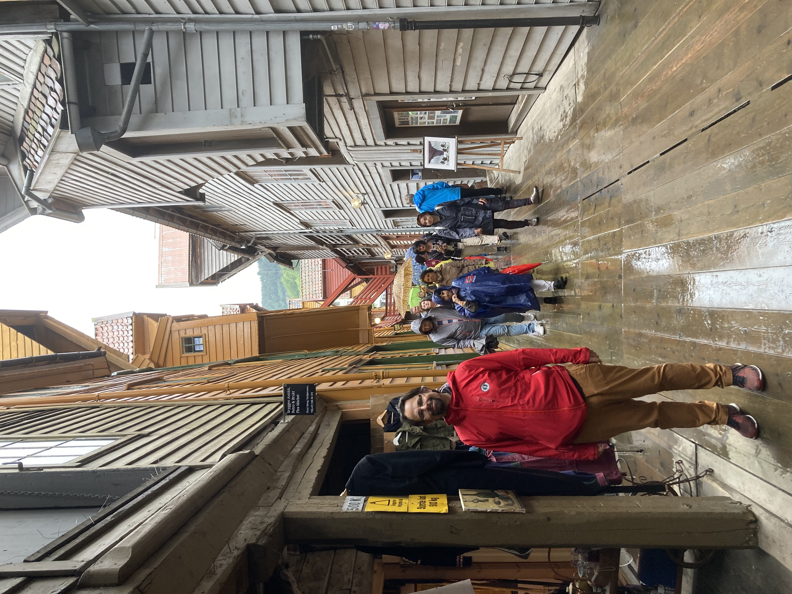

<!--
_class: invert lead
_footer: Photo by <a href="https://unsplash.com/@cblanco_31">Carlos Blanco</a> on <a href="https://unsplash.com/s/photos/gastown-clock">Unsplash</a>
-->

# **Temporal**

## The Curious Incident of the Wrong Nighttime

**Philip Chimento**  
<i class="fab fa-github"></i> ptomato • <i class="fa-brands fa-bluesky"></i> ptomato.name • <i class="fab fa-mastodon"></i> mstdn.ca/@ptomato  
**Igalia**, in partnership with Bloomberg  


<!--
My name is Philip Chimento. I work as a JavaScript engine developer at Igalia and I'm visiting here from Vancouver, Canada.

I'm going to talk today about Temporal. It's a proposal to add modern date and time handling to JavaScript. Not as a package but built in to JavaScript everywhere. I'm part of a group working on this proposal, and my participation is part of a partnership between Igalia and Bloomberg.
-->

---

# ECMA TC39

- I'm a delegate on the TC39 committee
- TC39 meets 6× / year


<!--
So the way to get something built into JavaScript everywhere is to participate in standardizing it in ECMA TC39. Which is what we are doing with Temporal. We meet bimonthly, alternating between fully remote and hybrid.

I want to tell you a story, specifically about one TC39 meeting a couple of years ago.
-->

---

# Bergen

July 2023 TC39 meeting at the University of Bergen, Norway

* I stayed there July 10-14



<!--
Two years ago TC39 met in Bergen, Norway and I was lucky enough to be able to travel there in person.

I'm going to tell you about a funny thing that happened when I booked my trip there. (I promise this is going somewhere that has to do with Temporal.)

So of course I need a place to stay.
At home in Vancouver, I went to the website of one of Bergen's fine hotel establishments to book a stay. So I put in my dates, check-in July 10, check-out July 14.

Then I clicked OK and got to the confirmation page.
-->

---

# Confirmation

Confirmation dates were **not** the ones I booked, July 10–14!


<!--
and I got THIS. to my surprise I was asked to confirm my stay with check-in July 9 and check-out July 13! Arriving and leaving one day earlier than I had just requested.

So now I want to know, what happened?
-->

---


<!--
 And so does this cat.

Well we can't know for sure because I didn't go and do a deep debugging dive on this hotel's website code.
But after dealing with dates and times for as long as I have, I would be willing to bet I know approximately what happened.
-->

---

(in the frontend, `TZ=America/Vancouver`)
```js
> year = 2023  // from
> month = 7    // date
> day = 10     // picker
```

<!--
On the frontend I picked my checkin and checkout dates. Let's simulate this by starting a REPL in my home time zone, and choosing the year, month, and day of my checkin date.
-->

---

(in the frontend, `TZ=America/Vancouver`)
```js
> year = 2023  // from
> month = 7    // date
> day = 10     // picker
> epochMs = new Date(year, month - 1, day).valueOf()
1688972400000
```

<!--
Then the frontend converts it to a timestamp in milliseconds to send to the backend. (they probably figured, a number of milliseconds is easier to serialize in something like JSON).

Note the -1, yes months are 0-based in the old JavaScript Date - one of the many things people hate about it
-->

---

(in the frontend, `TZ=America/Vancouver`)
```js
> year = 2023  // from
> month = 7    // date
> day = 10     // picker
> epochMs = new Date(year, month - 1, day).valueOf()
1688972400000
> sendBookingDateToBackend(epochMs)
```

<!-- sent! -->

---

(in the backend, `TZ=Europe/Oslo`)
```js
> epochMs = getBookingDateFromFrontend()
1688972400000
```

<!-- then on the backend - we simulate that by starting it in Norway's time zone - we receive that number of milliseconds -->

---

(in the backend, `TZ=Europe/Oslo`)
```js
> epochMs = getBookingDateFromFrontend()
1688972400000
> d = new Date(epochMs)
```

---

(in the backend, `TZ=Europe/Oslo`)
```js
> epochMs = getBookingDateFromFrontend()
1688972400000
> d = new Date(epochMs)
> year = d.getFullYear()
2023
```
<!-- then we get the year -->

---

(in the backend, `TZ=Europe/Oslo`)
```js
> epochMs = getBookingDateFromFrontend()
1688972400000
> d = new Date(epochMs)
> year = d.getFullYear()
2023
> month = d.getMonth() + 1
7
```
<!-- the month -->

---

(in the backend, `TZ=Europe/Oslo`)
```js
> epochMs = getBookingDateFromFrontend()
1688972400000
> d = new Date(epochMs)
> year = d.getFullYear()
2023
> month = d.getMonth() + 1
7
> day = d.getDate()
10
```
<!-- and the day -->

---

(in the backend, `TZ=Europe/Oslo`)
```js
> epochMs = getBookingDateFromFrontend()
1688972400000
> d = new Date(epochMs)
> year = d.getFullYear()
2023
> month = d.getMonth() + 1
7
> day = d.getDate()
10
> checkAvailable(year, month, day)
true
```

<!-- And we book it! Of course the hotel's database is using a 1-based month like normal people
And of course REAL hotel backends don't have a time-of-check-time-of-use bug like this, but I'm simplifying
-->

---

(in the backend, `TZ=Europe/Oslo`)
```js
> epochMs = getBookingDateFromFrontend()
1688972400000
> d = new Date(epochMs)
> year = d.getFullYear()
2023
> month = d.getMonth() + 1
7
> day = d.getDate()
10
> checkAvailable(year, month, day)
true
> epochMs = d.setHours(0, 0, 0, 0)
1688940000000
> sendConfirmedDateToFrontend(epochMs)
```

<!-- Then we serialize that date into a timestamp and send it back to the frontend for user confirmation. of course we are conscientious about our inputs so we chop off any extraneous time of day and make it midnight. Maybe you can see where this is going ... -->

---

(in the frontend again, `TZ=America/Vancouver`)
```js
> epochMs = getConfirmedDateFromBackend()
1688940000000
```

<!--
Then the front end which is running in my browser in my time zone, West coast of Canada, receives the number of milliseconds, creates a Date from it, and...
-->
---

(in the frontend again, `TZ=America/Vancouver`)
```js
> epochMs = getConfirmedDateFromBackend()
1688940000000
> new Date(epochMs).toLocaleDateString()
'2023-07-09' ⬅️ 😱😱😱
```

<!--
when you create a Date object, it assumes that you mean "in the current time zone" unless you specifically say UTC.

and well, that midnight timestamp is at 3 in the afternoon on the previous day in Vancouver! And so that's what my browser displayed to me when I saw the confirmation page.
-->

---

## So did I have a place to sleep on July 13th?

* Yes, I clarified with the hotel :smile:
* Could have been worse if I was living east of Norway!

<!--
So I emailed the hotel and confirmed that I did not actually have to spend my last night in Norway sleeping in the airport lounge.
They seemed to have the right dates on their end. So I think their booking system got it right, and it was just the confirmation page in my browser that was incorrectly displaying the dates.
But who knows if I'd lived east of Norway, it could've been the other way around! Where I saw the correct date but the booking system was off by one...
-->

---

## What does this have to do with Temporal?

Temporal is a proposal for enhancing JavaScript with a new, built-in, **strongly typed** date-time library

...and our design goal is to make it difficult to write bugs like this

* "Calendar date with no time" is a different type than "timestamp in milliseconds"!

<!--
Temporal is an API that has been proposed to become part of JavaScript. It's available in some browsers already and is coming to others soon. It will add a built-in library for dates and times to JavaScript, like many other programming languages already have.

So Temporal is designed with the understanding that "calendar date with no time" is conceptually a different thing than "timestamp in milliseconds"
-->

---

## How would you do this with Temporal?

```js
// from date picker:
> d = Temporal.PlainDate.from({ year: 2023, month: 7, day: 10 })
```

---

## How would you do this with Temporal?

```js
// from date picker:
> d = Temporal.PlainDate.from({ year: 2023, month: 7, day: 10 })

// serialize:
> s = d.toJSON()
"2023-07-10"
```

(or `toString()`, depending on your serialization needs)

---

## How would you do this with Temporal?

```js
// from date picker:
> d = Temporal.PlainDate.from({ year: 2023, month: 7, day: 10 })

// serialize:
> s = d.toJSON()
"2023-07-10"

// deserialize:
> d2 = Temporal.PlainDate.from(s)
> d2.equals(d)
true
// No nonsense! True anywhere in the world!
```

---

# What else is good about Temporal?

- Built in to the browser - part of the language!
- Immutable
- Strong support for internationalization

<!--
There's other good stuff about Temporal! I want to zero in on one thing from this list here.
Temporal is built-in to the browser or JS engine. That's important because many developers include a dependency on Moment or some similar library in their app to achieve the same thing that you could with Temporal. But, depending on how much locale data you include, this may add a payload of anywhere from a dozen to two hundred kilobytes to the app.
-->

---

<!--
_footer: Photo by <a href="https://unsplash.com/@pratiksha_mohanty">Pratiksha Mohanty</a> on <a href="https://unsplash.com/s/photos/spices">Unsplash</a>
-->

# Types: Do more, but also do less

We designed each type so that it's **easy** to do the things you're supposed to do and **difficult** to do the things that you **shouldn't** do


<!--
Now I'll give a little tour of the available types.

Our design philosophy was that you should be able to do _more_ with Temporal than you could with the old Date, but do _less_ with each individual type. In particular, make common mistakes difficult to do by accident.
-->

---

<!-- _footer: \\*disregarding leap seconds, though -->

# `Temporal.Instant`

- An exact moment in time\*
- No time zone, no summer and winter time
- No calendar
- Data model: elapsed nanoseconds since midnight UTC, Jan. 1, 1970

<!--
The first type you should know about is Instant. It represents what we call an exact time, an instantaneous point on the timeline, with nanosecond resolution. There is no calendar, so no months, weeks, years, or days; no time zone, so no daylight saving adjustments. Just purely a mostly-increasing number.
-->

---

# Plain types

- ‘Wall’ time
- No time zone, no summer and winter time
- Represent the information you have
- Avoid buggy pattern of filling in 0 for missing info
- Do appropriate calculations based on type

<!--
Next we have a family of types called the "Plain" types. These represent a date on your wall calendar and a time on your wall clock, which we call "wall" time for short.
They represent your local date and time independent of time zone, and so there are no daylight saving adjustments.
But unlike Instant, they are not exact moments in time. A wall time like "November 18th 2024 at half past two" occurs at several different exact times around the world.

The wall types are a whole family of types with progressively less information.
That's so that you can correctly represent the information that you have. For example, with the old Date, if you wanted to represent a date without a time, you might use midnight. As we've seen, that can lead to hotel bookings getting messed up!
-->

---

# Plain types

- `Temporal.PlainDate`: “The conference session on June 12th, 2025”
- `Temporal.PlainTime`: “The Q&A is at 17:25”
- `Temporal.PlainYearMonth`: “The June 2025 board meeting”
- `Temporal.PlainMonthDay`: “My birthday is December 15th”

<!--
In Temporal, these are the types that carry less information:

PlainDate is a day without a specific clock time. It's a very common use case!

PlainTime is a clock time, not on any specific day.

PlainYearMonth is a month without a specific day. You could think of using it to refer to an event that happens occasionally, like I have there "the November 2024 board meeting". It also corresponds to HTML input type month.

PlainMonthDay is a calendar date, but without a specific year. You could think of it as referring to a birthday or anniversary.
-->

---

# `Temporal.ZonedDateTime`

- Like `Temporal.Instant`, an exact time
- But also with a calendar and time zone
- Correctly accounts for the time zone's daylight saving rules
- “The conference session is on Thursday, June 12th, 2025, at 4:55 PM, Western European Summer Time”

<!--
Then we have one more exact time type, ZonedDateTime. Just like Instant, this type represents an exact moment in time. But it is also coupled to a location with time zone rules, because it includes a time zone. The time zone means that this type does account for summer and winter time. It also has a calendar, which means that it does have a year, month, and day. So it's an exact time that has all the information it needs to give you a wall time as well.

We say that ZonedDateTime represents a calendar event that happened, or will happen, at a place on Earth.
-->

---

# `Temporal.Duration`

- returned from other types' `since()` and `until()` methods
- passed to their `add()` and `subtract()` methods

<!--
There is one more type that's part of Temporal and doesn't represent a date or a time. Duration is used in arithmetic with the other types.
-->

---

<!--
_class: invert lead
_footer: Photo by <a href="https://unsplash.com/@lordarcadius">Vipul Jha</a> on <a href="https://unsplash.com/s/photos/code">Unsplash</a>
-->

# Show me the code!


<!--
Now that you've been introduced to the API, it's time to show how to accomplish a programming task. I've got a worked example here.
-->

---

<!-- _class: lead invert -->

# A worked example

What times are these conference sessions for me?


<!--
I got this from a conference website. (I would've loved to use the JSNation website for this, but it conveniently already puts the sessions in your browser's local time zone. Well done!)

We need to answer the question, using the information on this conference website, what times do these sessions happen for me? Which sessions can I attend, when I'm not asleep?

This question turns out to be surprisingly hard to answer, if we _don't_ use a computer, because it requires a lot of mental gymnastics with time zones and subtracting or adding hours. Most people, myself included, just put "11 o'clock AEST" into a search engine and hope that the search engine correctly guesses what I want. Temporal's strongly typed approach is perfect for solving this problem.
-->

---

# What time is the conference for me?

What we know:
- The two calendar dates that the sessions occur on (July 23 & 30, 2025)
- The start times of the sessions and their time zones (11 AM AEST, noon BST, 1 PM EDT)
- My time zone
- The hours (in my local time) at which I am willing to be at my computer

<!--
Here are the facts that we know. We know from the website the two calendar dates of the conference: July 23rd and 30th.

There are three sessions on each conference day. We know the local start times and lengths of each of the three sessions, and what time zones those local start times are given in.

I also know my time zone, and I know the hours in my local time zone during which I'm willing to be online watching a conference.
-->

---

# What time is the conference for me?

- For each session date,
  - For each session,
    - Calculate the exact time of that session start and end on that date;
    - If the local time of the session in my time zone falls within the hours that I'm willing to be at my computer,
      - Print the local time of the session in my time zone.

<!--
Here's pseudocode of what we need to do. For each date and each session, we know the wall time and the time zone, which allows us to figure out the exact time that the session starts and ends. Then we need to go from exact time back to wall time in my time zone to check whether I'm awake or not. If I am, then we print out that session.
-->

---

## What time is the conference for me?

```js
const dates = [
  Temporal.PlainDate.from('2025-07-23'),
  Temporal.PlainDate.from('2025-07-30')
];
const sessions = [
  { timeZone: 'Australia/Brisbane', hour: 11 },
  { timeZone: 'Europe/London', hour: 12 },
  { timeZone: 'America/New_York', hour: 13 }
];
const sessionLength = Temporal.Duration.from({ hours: 4 });
const myTimeZone = Temporal.Now.timeZoneId();
```

<!--
Here's the first part of the code, where we set things up. We have the calendar dates, the session time zones and start hours, the length of the sessions, and my time zone.

There are a few things to explain here. One of them is how I determined these time zone names! On the website we had Australia Eastern Standard Time, British Summer Time, and Eastern Standard Time (with North America implied in that last one.) But those are human names, not machine identifiers. These strings with the slashes, like Australia-slash-Brisbane, are the official identifiers of the IANA time zone database, and that's how you refer to time zones in Temporal. If you don't know the IANA identifier for a particular time zone, you can usually find it out on Wikipedia. Sometimes the human abbreviations are ambiguous, but the identifiers are always precise.
-->

---

## What time is the conference for me?

```js
const myCoffeeTime = Temporal.PlainTime.from('08:00');
const myBedtime = Temporal.PlainTime.from('23:00');

function iCanBeOnlineAt(time) {
  return Temporal.PlainTime.compare(myCoffeeTime, time) <= 0 &&
         Temporal.PlainTime.compare(time, myBedtime) <= 0;
}
```

<!--
The other piece of data that I mentioned we know is what times I'm willing to be online for the conference. I want to write a little function that takes a wall-clock time and returns true if the time is within my online hours.
 
For that we have to do comparisons. Each type has a compare static method that we use for this. There's also an equals method that checks whether two Temporal objects are equal, but here we need real comparisons.
-->

---

## What time is the conference for me?

```js
const formatter = new Intl.DateTimeFormat('en-ca', { dateStyle: 'full', timeStyle: 'short' });
console.log('Put the conference in your calendar:');
dates.forEach((date) => {
  sessions.forEach(({ timeZone, hour }) => {
    const sessionStart = date.toZonedDateTime({ timeZone, plainTime: { hour } });
    const mySessionStart = sessionStart.withTimeZone(myTimeZone);
    const mySessionEnd = mySessionStart.add(sessionLength);
    if (iCanBeOnlineAt(mySessionStart) && iCanBeOnlineAt(mySessionEnd)) {
      console.log(formatter.formatRange(
        mySessionStart.toPlainDateTime(), mySessionEnd.toPlainDateTime()));
    }
  });
});
```

<!--
And now this code is how the actual calculation works, that I previously outlined in pseudocode.

We loop through each conference date and the info for each session, and convert it to the exact time sessionStart, as a ZonedDateTime. Then we use the withTimeZone method to get a new ZonedDateTime object for the start of the session in my time zone, instead of the conference session's time zone. Then we add the session length using the add method, to get the end of the session in my time zone. These we pass to our comparison function, and if they are during my online times, we print out the start and the end of the session using formatRange.
-->

---

## What time is the conference for me?

```
Put the conference in your calendar:
Tuesday, July 22, 2025, 6:00–10:00 p.m.
Wednesday, July 23, 2025, 10:00 a.m.–2:00 p.m.
Tuesday, July 29, 2025, 6:00–10:00 p.m.
Wednesday, July 30, 2025, 10:00 a.m.–2:00 p.m.
```

<!--
Take that code, put it all together, run it, and here is the nicely formatted answer! (This is the answer in my time zone, with my locale's formatting, with dateStyle full and timeStyle short. Your answer will likely be different.)

(if time, show browser page)
-->

---

## When can I use it?

- https://caniuse.com/?search=Temporal
- Firefox unflagged in version 139!
- Safari has some of it available behind a flag in Tech Preview
- Opportunity to get involved shipping in Chrome/V8: https://github.com/boa-dev/temporal


<!--
I should mention there's an interesting opportunity to get involved in getting Temporal shipped in Chrome right now. Chrome is sharing the implementation first written by the Boa JS engine. They have a Rust crate called "temporal_rs" which is used by both engines. Temporal_rs is welcoming contributions! So if you like writing Rust and you want to help TWO JavaScript engines get up to full implementation status, this is a great low-friction opportunity to contribute.
-->

---

# Learning more

- MDN: https://developer.mozilla.org/en-US/docs/Web/JavaScript/Reference/Global_Objects/Temporal
- Temporal Cookbook: https://tc39.es/proposal-temporal/docs/cookbook.html

<!--
I hope you've found this a useful tour of Temporal. And if you have the old Date object in your code base, I hope you're excited to replace it with Temporal! You can check out the documentation on MDN at this link, and here is another link to a cookbook with all sorts of Temporal recipes for common tasks.
-->

---

# Partnering with Igalia

- **JS:** BigInt, class fields, JSON imports, Temporal, AsyncContext, ...
- **Node.js:** require(esm), compile cache, register hooks, ...
- **Web:** Servo, :has(), CSS grid, MathML, ...
- **And more!** Chromium & WebKit embedding, graphics, RISC-V, ...

<span style="text-align:center;">


</span>

<!--
As much as we love open standards and the web by ourselves... we do all this through collaborations with other companies. Maybe you would like to collaborate with us on improving the state of the web platform?

We do other things such as Chromium and WebKit embedding, multimedia, RISC-5

Come talk to me or one of my coworkers during the conference!
-->

---

<!-- _class: invert -->

<!-- Thank you for your attention. -->
