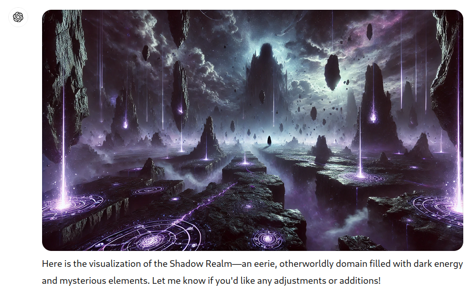

<!--
_class: invert lead
-->

# 🌒 **ShadowRealm** 🌘
## for Stage 3

**Philip Chimento**
Igalia, in partnership with Salesforce  
TC39 December 2024  
—  
**NOTE** - checklists will continue to be updated until the meeting

---

# Recap: What is ShadowRealm?

A mechanism to execute JavaScript code within the context of a new global object and set of built-ins.

Goal is not **security**, but **integrity**: complete control over the execution environment.

```js
globalThis.someValue = 1;
const realm = new ShadowRealm();
realm.evaluate(`globalThis.someValue = 2;`);
console.assert(globalThis.someValue === 1);
```

---

<!-- _backgroundColor: white -->



---

# Recap: Proposal history

- Everything revolves around the question [**Which web APIs should be present inside ShadowRealm**](https://github.com/tc39/proposal-shadowrealm/issues/393)?
- Several different ways of answering this question have been proposed and rejected:
  - "None"
  - A vetted list
  - A criterion based on confidentiality

---

# Recap: Proposal history

- **Sept. 2023**: Stage 2, readvancement pending explicit support from two implementations that the testing and list of APIs to be exposed to ShadowRealms are sufficient
- **Feb. 2024**: Stage 2.7, with the understanding that stage 3 requires signoff from HTML folks on the HTML integration, as well as resolution of Mozilla's concerns about test coverage
- Not an opportunity to relitigate previous design decisions

---

# Today: Exposed web APIs

**Which web APIs should be present inside ShadowRealm?**

- New W3C TAG [design principle](https://github.com/w3ctag/design-principles/pull/510):
  - Only purely computational features are exposed everywhere
    - not performing I/O
    - not affecting the state of the user agent or the user's device
  - Exception: Anything relying on an event loop is not exposed
  - Expose conservatively: features primarily useful for unexposed feature are not exposed

---

# Today: Exposed web APIs

- Developed based on a number of conversations with implementors and web platform experts
- Clear criterion to decide whether something is in or out
- Distinction between "which standards body standardized a feature" is irrelevant

**Update:** Full list of 1300+ global properties, which are in/out, & why: [📋spreadsheet](https://docs.google.com/spreadsheets/d/1x0Uho2vkvhUpFmZi73QvvwNqdrWyvJMZ-2yo4YGoPzU)

---

# Today: HTML integration

- Pull request: [whatwg/html#9893](https://github.com/whatwg/html/pull/9893)
- Design settled and reviews have occurred
- Fixing details
- Some mechanical work needed in specs downstream of HTML to use new terminology

---

# Today: Test coverage

- ✅ [Test APIs in ShadowRealms created in multiple scopes](https://github.com/web-platform-tests/wpt/issues/48573)
  - ✅ Window
  - ✅ Worker
  - ✅ SharedWorker
  - ✅ ServiceWorker
  - ✅ AudioWorklet
  - ✅ other ShadowRealm

---

# Today: Test coverage

- ✅ **Abort**: AbortController, AbortSignal (except AbortSignal.timeout not exposed) ([PR](https://github.com/web-platform-tests/wpt/pull/41965))
- ✅ **Base64**: atob, btoa ([PR](https://github.com/web-platform-tests/wpt/pull/49188))
- ✅ **console** (PR [1](https://github.com/web-platform-tests/wpt/pull/34361), [2](https://github.com/web-platform-tests/wpt/pull/49283))
- ✅ **crypto**.getRandomValues, crypto.randomUUID ([PR](https://github.com/web-platform-tests/wpt/pull/44137) - pending acceptance by WebCrypto spec)
- ✅ **DOMException** ([PR](https://github.com/web-platform-tests/wpt/pull/49159))
- ✅ **Encoding**: TextDecoder, TextDecoderStream, TextEncoder, TextEncoderStream (PR [1](https://github.com/web-platform-tests/wpt/pull/41968), [2](https://github.com/web-platform-tests/wpt/pull/49286) - pending review)

---

# Today: Test coverage

- ✅ **Error handler**: ErrorEvent, onerror, reportError ([PR](https://github.com/web-platform-tests/wpt/pull/49325) - pending review)
- ✅ **Events**: addEventListener, CustomEvent, dispatchEvent, Event, EventTarget (including `globalThis` being one), removeEventListener ([PR](https://github.com/web-platform-tests/wpt/pull/41966) - pending review)
- ✅ **isSecureContext** ([PR](https://github.com/web-platform-tests/wpt/pull/49365) - pending review)
- ✅ **Observable**, Subscriber ([PR](https://github.com/web-platform-tests/wpt/pull/49322) - pending review)
- ✅ **Promise rejection**: onrejectionhandled, onunhandledrejection, PromiseRejectionEvent ([PR](https://github.com/web-platform-tests/wpt/pull/49341) - pending review)

---

# Today: Test coverage

- ✅ **queueMicrotask** and evaluation order: ([PR](https://github.com/web-platform-tests/wpt/pull/49325) - pending review)
- ✅ **self** ([PR](https://github.com/web-platform-tests/wpt/pull/49252))
- ✅ **Streams**: ByteLengthQueuingStrategy, CompressionStream, CountQueueingStrategy, ReadableByteStreamController, ReadableStream, ReadableStreamBYOBReader, ReadableStreamBYOBRequest, ReadableStreamDefaultController, ReadableStreamDefaultReader, TransformStream, WritableStream, WritableStreamDefaultController, WritableStreamDefaultWriter (PR [1](https://github.com/web-platform-tests/wpt/pull/42005), [2](https://github.com/web-platform-tests/wpt/pull/49321) - pending review)

---

# Today: Test coverage

- ✅ **Structured clone**: DataCloneError, structuredClone ([PR](https://github.com/web-platform-tests/wpt/pull/49282) - pending review)
- ✅ **URL**, URLSearchParams ([PR](https://github.com/web-platform-tests/wpt/pull/41985) - pending Interop question)
- ✅ **URLPattern** ([PR](https://github.com/web-platform-tests/wpt/pull/49323) - pending acceptance by URLPattern spec)
- ✅ **WebAssembly** (PR [1](https://github.com/web-platform-tests/wpt/pull/36412), [2](https://github.com/web-platform-tests/wpt/pull/41987)) (except `compileStreaming` and `instantiateStreaming` not exposed)
- WebAssembly **ESM imports**

---

# Today: Test coverage

- ✅ Remove tests for things no longer exposed under the criterion
- ❌ Not currently covered in WPT at all: TransformStreamDefaultController, WebTransportWriter

---

# Requirements for stage 3

- ✅ The feature has sufficient testing and appropriate pre-implementation experience 

**Specific to ShadowRealm**
- Explicit support from two implementations that the testing and list of APIs to be exposed to ShadowRealms are sufficient
- Signoff from HTML folks on the HTML integration
- Resolution of Mozilla's concerns about test coverage

---

<!-- _class: lead -->

# Questions?

---

<!-- _class: lead -->

# Consensus to move the proposal to stage 3?

---

# Proposed summary for notes

> (to be added)
