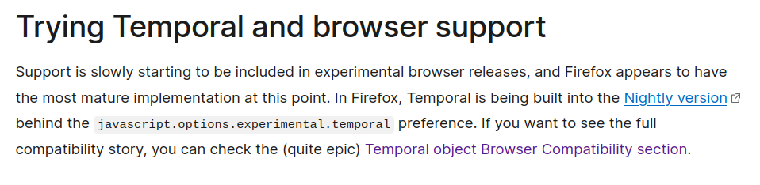
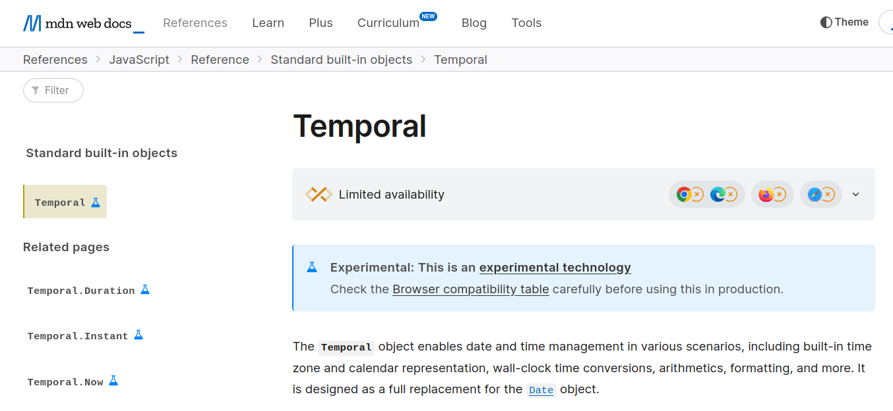

<!--
_class: invert lead
-->

# 🌒 **ShadowRealm** 🌘
## Update

**Philip Chimento**
Igalia, in partnership with Salesforce  
TC39 February 2025

---

# Recap: What is ShadowRealm?

A mechanism to execute JavaScript code within the context of a new global object and set of built-ins.

Goal is **integrity**: complete control over the execution environment.

```js
globalThis.someValue = 1;
const realm = new ShadowRealm();
realm.evaluate(`globalThis.someValue = 2;`);
console.assert(globalThis.someValue === 1);
```

---

<!-- _backgroundColor: white -->


---

### Which web APIs are present inside ShadowRealm?

- New W3C TAG [design principle](https://www.w3.org/TR/design-principles/#expose-everywhere)
- Full list of 1300+ global properties, which are in/out, & why: [📋spreadsheet](https://docs.google.com/spreadsheets/d/1x0Uho2vkvhUpFmZi73QvvwNqdrWyvJMZ-2yo4YGoPzU)
- Follow ups from last meeting:
  - `crypto.subtle`? Currently depends on event loop
  - Some of the Web Platform Tests still need reviews

---

# In search of use cases

- We'd like to shore up how convincing our use cases are
- In order to get browsers excited about implementing the HTML integration for ShadowRealm
- WHATWG likes to hear "how does this benefit end-users of the web"
- If you have a use case, please come talk to me!

---

<!-- _class: lead -->

# Questions?

---

---


<!--
_class: invert lead
-->

# ⌚ **Temporal**

**Philip Chimento**
Igalia, in partnership with Bloomberg  
TC39 February 2025

---

## Progress update

After 7 years, Temporal is close to done. We have cleaned out the issue tracker and finished all the editorial changes that anyone has requested. We will continue to analyze code coverage metrics, submit additional test262 tests, and answer any questions raised.

---

## Ship it! 🐿️

Please go ahead with implementations and **ship them, unflagged** when they are ready.
- If something is preventing you from shipping Temporal, let us know and work with us to resolve ASAP
- Don't wait! If we need to make changes, we want to make them now

You are welcome at the **Temporal champions meeting, biweekly Thursdays at 08:00 Pacific** (or we will happily meet another time if this time doesn't work for you)

---

## Shipped in Firefox Nightly



---

## Shipped on MDN



---

## Test conformance as of February 2025

<div class="twocol">
<div>

- SpiderMonkey: ~100%
- Ladybird: 97%
- GraalJS: 89%
- V8: 74%
- Boa: 72%
- JavaScriptCore: 40%

</div>
<div>
  <canvas id="conformance-chart"></canvas>
</div>
</div>

<script src="https://cdn.jsdelivr.net/npm/chart.js"></script>

<script>
  const ctx = document.getElementById('conformance-chart');

  const results = {
    'SM': 4538,
    'Ladybird': 4397,
    'GraalJS': 4025,
    'V8': 3343,
    'Boa': 3268,
    'JSC': 1817,
  };
  const totalTests = 4547;

  Chart.defaults.font.family = 'Rubik';
  Chart.defaults.font.size = 16;
  new Chart(ctx, {
    type: 'bar',
    data: {
      labels: Object.keys(results),
      datasets: [{
        label: '% of test262 passing',
        // do not use =>
        data: Object.values(results).map(function (x) { return x * 100 / totalTests }),
        backgroundColor: '#a40000',
      }],
    },
    options: {
      aspectRatio: 1.4,
      indexAxis: 'y',
    },
  });
</script>

<!--
npx test262-harness --hostType=sm --hostPath=$HOME/workspace/gecko/obj-debug-x86_64-pc-linux-gnu/dist/bin/js -f Temporal --hostArgs=--enable-temporal "test/**/*.js"
npx test262-harness --hostType=v8 --hostPath=$HOME/.esvu/bin/v8 -f Temporal --hostArgs=--harmony-temporal -- "test/**/*.js"  # requires https://github.com/bterlson/eshost/pull/139
npx test262-harness --hostType=jsc --hostPath=$HOME/.esvu/bin/ladybird-js -f Temporal --hostArgs=--use-test262-global -- "test/**/*.js"
npx test262-harness --hostType=jsc --hostPath=$HOME/.esvu/bin/jsc -f Temporal --hostArgs=--useTemporal=1 -- "test/**/*.js"
cargo run --release --bin boa_tester -- run --test262-path $HOME/workspace/test262 -s ...
  (test/built-ins/Temporal, test/intl402/Temporal, test/staging/Temporal, test/staging/Intl402/Temporal, test/intl402/DateTimeFormat/prototype/format*/temporal-*)
npx test262-harness --hostType=graaljs --hostPath=$HOME/.esvu/bin/graaljs -f Temporal --hostArgs='--experimental-options --js.temporal' -- "test/**/*.js"
npx test262-harness --hostType=node --hostPath=$HOME/.local/bin/deno -f Temporal --hostArgs='run --unstable-temporal' -- "test/**/*.js"
-->

---

<!-- _class: invert lead -->

# Bug fix

---

### Excessive years in month-day strings (PR [#3054](https://github.com/tc39/proposal-temporal/pull/3054))

You can create a PlainMonthDay in the ISO 8601 calendar even with a year arbitrarily far in the past or future, because the year can be ignored; that remains unchanged. For non-ISO 8601 calendars, throw.

This change was requested by Firefox as part of their implementation.

```js
Temporal.PlainMonthDay.from('+999999-01-01');
  // PlainMonthDay of 01-01, ISO 8601 calendar; unchanged
Temporal.PlainMonthDay.from('+999999-01-01[u-ca=chinese]');
  // Current: Requires implementation to calculate a million lunar years into the future,
  // well outside the supported date range, to arrive at a probably nonsensical answer
  // Proposed: throw RangeError
```

---

<!-- _class: lead -->

# Consensus on the bug fix?

## Questions?

---

# Proposed summary for notes

> With Firefox Nightly shipping the proposal and MDN adding documentation for it, there is a surge of interest in Temporal.
>
> Implementations should complete work on the proposal and ship it, and let the champions know ASAP if anything is blocking or complicating that. You are welcome to join the champions meetings.
>
> A normative change was adopted, to relax requirements on implementations for calculating PlainMonthDays in non-ISO calendars outside the supported PlainDate range (PR [#3054](https://github.com/tc39/proposal-temporal/pull/3054)).
