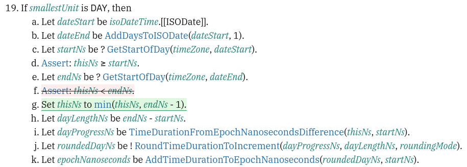
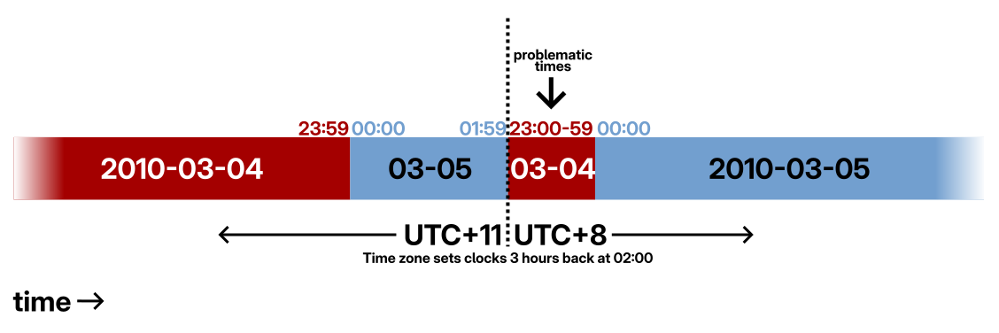
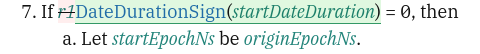

<!--
_class: invert lead
-->

# ⌚ **Temporal** progress update

**Philip Chimento**
Igalia, in partnership with Bloomberg  
TC39 May 2026

---

## Progress report

- Temporal advanced to Stage 4 in March 2026
- Merging into specifications is awaiting editor review
- Feedback from Firefox on assertion failures in the spec

---

## Merging into specifications

- ECMA-262 PR: [#3759](https://github.com/tc39/ecma262/pull/3759)
- ECMA-402 PR: [#1044](https://github.com/tc39/ecma402/pull/1044)
- We've received helpful, largely editorial, feedback from people working on implementations.
- Added as "fixup" commits so that implementations can see what's changed.
- When these PRs are merged, plan is to sync them back to the proposal-temporal repo and archive it

---

## Issues found in Firefox fuzzing

Three assertion failures in the spec discovered via automated fuzzing of the SpiderMonkey implementation:

- [#3310](https://github.com/tc39/proposal-temporal/issues/3310) - Duration rounding window falls inside 24-hour UTC shift
- [#3311](https://github.com/tc39/proposal-temporal/issues/3311) - ZonedDateTime difference with wall-clock sign opposite to epoch sign, on different calendar days
- [#3312](https://github.com/tc39/proposal-temporal/issues/3312) - ZonedDateTime round to day when the day starts twice

All three of these concern weird, rare edge cases in the time zone database.

<!--
(Either Antarctica time zones, or shifts from )
-->

---

## Subsequent issue found

While investigating the assertion failures we found a further edge case that shows up in duration rounding with non-default rounding modes, while rounding and balancing: [#3316](https://github.com/tc39/proposal-temporal/issues/3316)

---

## Resolution plan

We are investigating these issues, and the fixes may need to be needs-consensus PRs. If that's the case, we'll add the fixes to the agenda when we have them.

If that is after the agenda deadline and there wasn't enough time for delegates to review, we'll re-propose the fix in the following plenary.

---

## Proposed fix for issue [#3312](https://github.com/tc39/proposal-temporal/issues/3312)

(in [Temporal.ZonedDateTime.prototype.round](https://github.com/tc39/ecma262/pull/3759/changes#diff-b8366cd022bbec4ef320cc231afb079be7c3a6f58dea21997292583187680e94R618))

---

---

## Proposed fix for issue [#3316](https://github.com/tc39/proposal-temporal/issues/3316)

(in [ComputeNudgeWindow](https://github.com/tc39/ecma262/pull/3759/changes#diff-46da5350aa773fc90f84b2843468b534a32866793a1e346dca2b4d1f29c24a01R1170))

---

# Proposed summary for notes

- Temporal is at Stage 4. Spec integration PRs are open in [ECMA-262](https://github.com/tc39/ecma262/pull/3759) and [ECMA-402](https://github.com/tc39/ecma402/pull/1044), awaiting editor review.
- Three assertion failures found via Firefox fuzzing ([#3310](https://github.com/tc39/proposal-temporal/issues/3310), [#3311](https://github.com/tc39/proposal-temporal/issues/3311), [#3312](https://github.com/tc39/proposal-temporal/issues/3312)) concern rare time zone edge cases. Fixes are under investigation and may require needs-consensus PRs.
- A further edge case ([#3316](https://github.com/tc39/proposal-temporal/issues/3316)) was found in duration rounding with non-default rounding modes; a fix is proposed.
