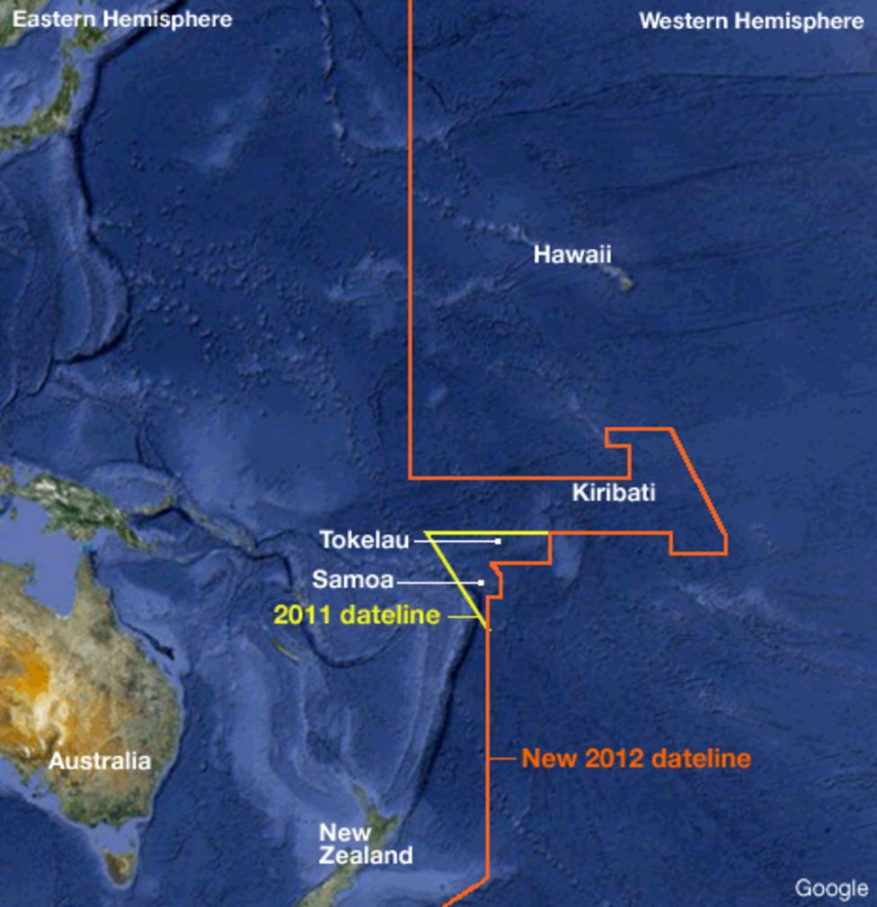
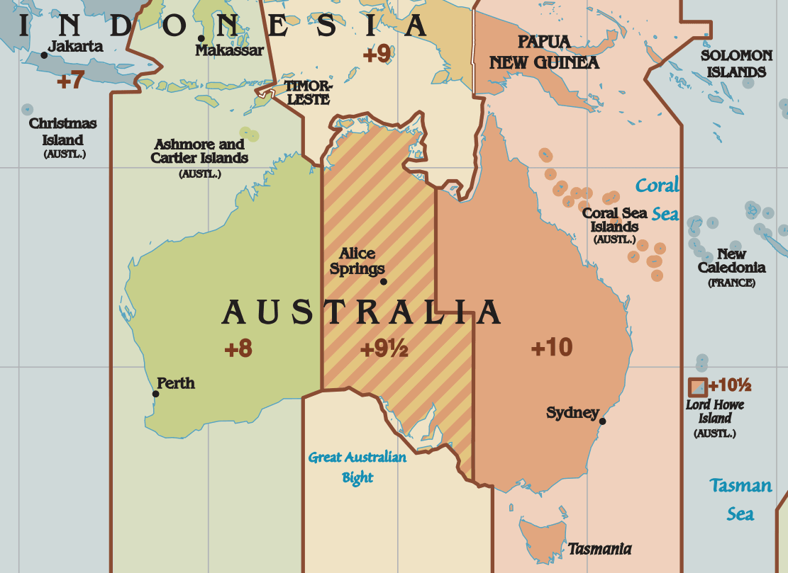
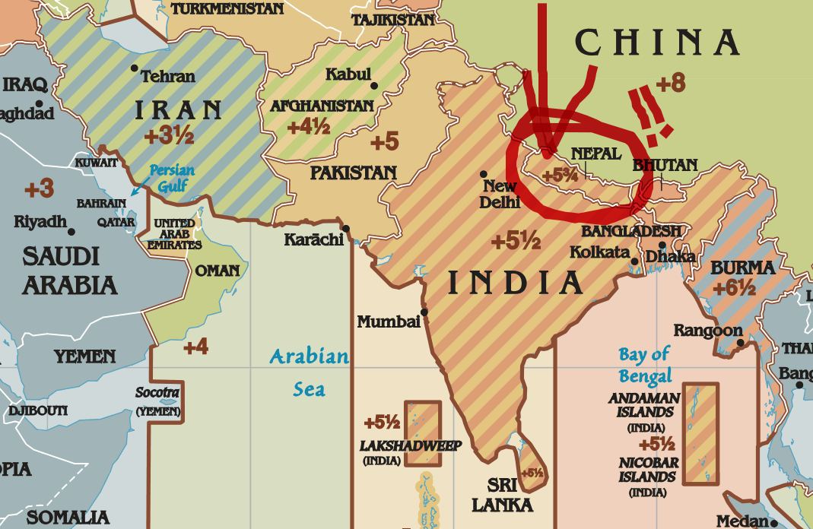
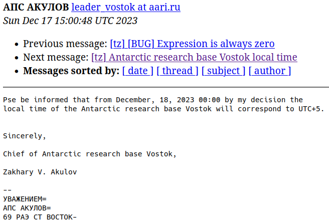
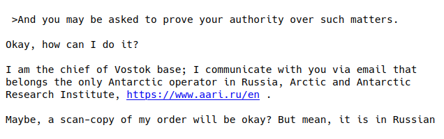
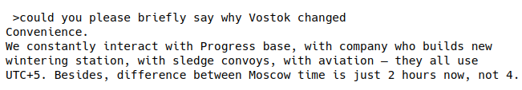
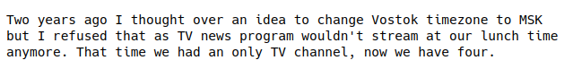

<!-- _class: lead -->

# :rainbow: Time Zone Horror Stories :unicorn:

---

<!-- _class: lead gaia -->

# How many hours in a day?

---

<!-- _class: lead invert -->

# WRONG

<!--
Daylight saving time. When you spring forward, the day is 23 hours long. When you fall back, the day is 25 hours long.
-->

---

<!-- _class: lead gaia -->

# So days are 23, 24 or 25 hours?

---

<!-- _class: lead invert -->

# WRONG

<!--
Lord Howe Island in Australia shifts by 30 minutes, so the days there are 23.5, 24, or 24.5 hours

OK, let's forget about hours. Let's talk about seconds and minutes.
-->

---

<!-- _class: lead gaia -->

# How many seconds in a minute?

---

<!-- _class: lead invert -->

# WRONG

<!--
Ever heard of leap seconds?

* Accommodate for random fluctuations in the rotation of the earth
* Announced 6 months in advance
* Abolished starting 2035
* So far, only added and never yet subtracted
* In POSIX, we pretend they don't exist and hope for the best
-->

---

<!-- _class: lead gaia -->

# If you divide the globe into 24 time zone slices, what does it look like?

---

<!-- _class: lead invert -->

---

<!-- _class: lead gaia -->

# OK, the slices aren't equal, but

### ...surely there are 24 of them, one for each hour?

---

<!--
_class: lead invert
_footer: <a href="https://jakubmarian.com/5-weird-things-you-didnt-know-about-time-zones/">@JakubMarian</a>
-->

<!--
  30 minutes: India (one-sixth of the world's population!), Sri Lanka, Afghanistan, Iran, Myanmar, Marquesas Islands, several time zones in Australia, one time zone in Canada
-->

---

<!-- _class: lead gaia -->

# OK, but boundaries are on the half hour?

---

<!--
_class: lead invert
_footer: <a href="https://jakubmarian.com/5-weird-things-you-didnt-know-about-time-zones/">@JakubMarian</a>
-->

<!--
  45 minutes: Nepal, one time zone in Australia
-->

---

<!-- _class: lead gaia -->

# ...15 minutes?

---

<!-- _class: lead invert -->

# WRONG

<!--
This may not exist anymore, but in the computing era, as recently as 1972, Liberia had a time zone offset of 44 minutes 30 seconds.
-->

---

<!-- _class: lead gaia -->

# When does a day start?

---

<!-- _class: lead invert -->

# WRONG

<!-- clock forward at midnight - day starts at 1:00 -->

---

<!-- _class: lead gaia -->

# How many times does a day start...

# ...per day?

---

<!-- _class: lead invert -->

# WRONG

<!-- clock backwards at midnight - day starts twice -->

---

<!-- _class: lead -->

<!--
We're just gonna leave you with this fun story.
Pause the frame if you're watching the stream.
Thank you.
-->
